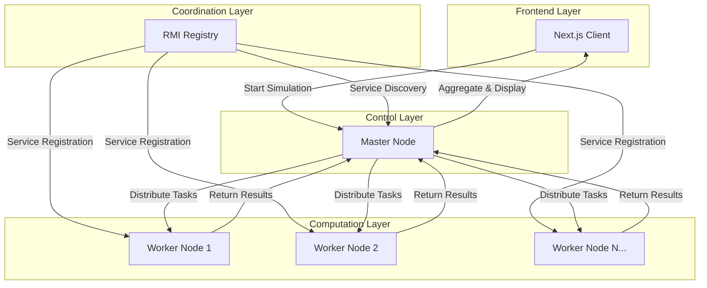
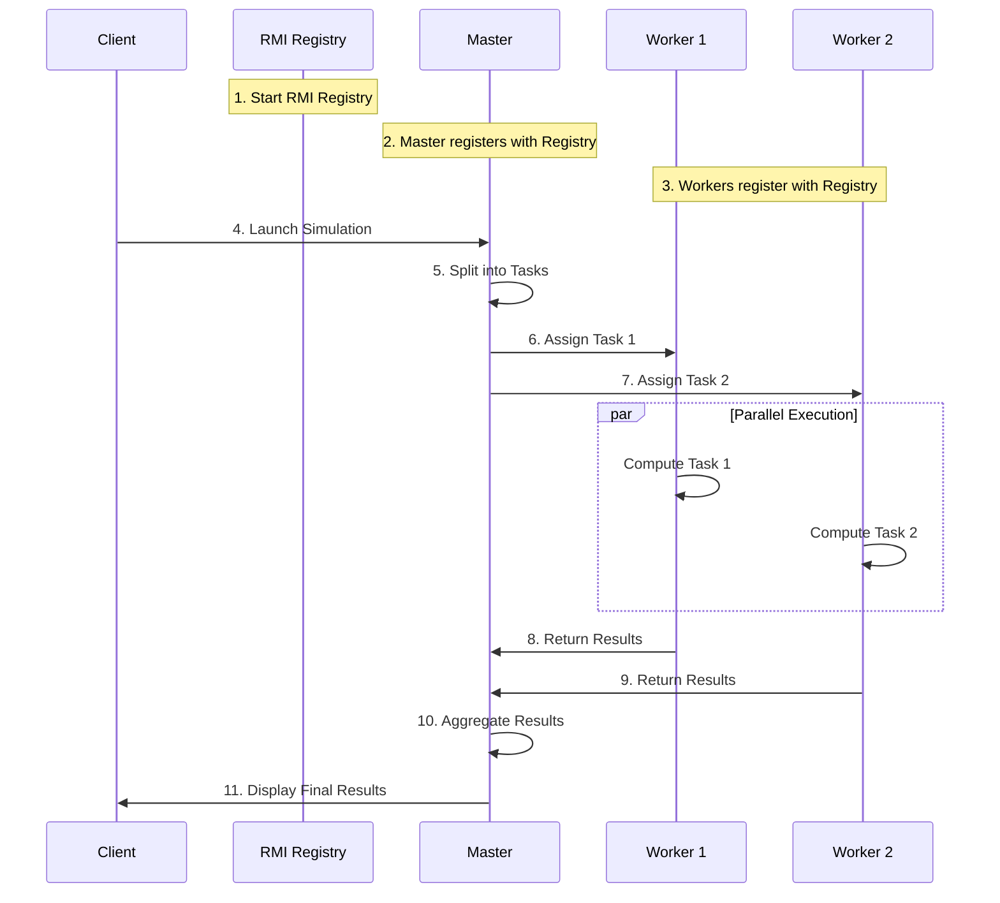

# **Distributed CPU Monte Carlo Traffic**  
## **Grid Computing Simulation Platform**

   

---

## **📋 Table of Contents**
1. [Project Overview](#-project-overview)
2. [System Architecture](#-system-architecture)
3. [How It Works](#-how-it-works)
4. [Technologies Used](#-technologies-used)
5. [Installation & Execution](#-installation--execution)
6. [Network Configuration](#-network-configuration)
7. [Scalability & Multi-Workers](#-scalability--multi-workers)
8. [Future Improvements](#-future-improvements)
9. [Contact](#-contact)

---

## **🚀 Project Overview**

**Distributed CPU Monte Carlo Traffic** is a high-performance Grid Computing platform designed to distribute CPU-intensive Monte Carlo simulations across multiple machines (Workers) managed by a central Master node.

### **🎯 Goals**
- **Leverage distributed CPU power** across multiple nodes
- **Execute simulations in parallel** for faster computation
- **Aggregate results efficiently** with minimal overhead
- **Provide a modern user interface** using Next.js for visualization
- **Support dynamic worker scaling** for on-demand computation

---

## **🏗️ System Architecture**



### **Architecture Components**

| Component | Role | Description |
|-----------|------|-------------|
| **RMI Registry** | Service Discovery | Central registry for coordinating nodes |
| **Master Node** | Task Manager | Splits simulations, assigns tasks, aggregates results |
| **Worker Nodes** | Computation Units | Perform CPU-intensive calculations |
| **Client/Frontend** | User Interface | Next.js app for simulation control and visualization |

---

## **⚙️ How It Works**

### **Workflow Overview**


### **Key Features**
- **Asynchronous execution** - Workers process tasks independently
- **Dynamic scaling** - Workers can join/leave during execution
- **Fault tolerance** - System continues if workers disconnect
- **Load balancing** - Tasks distributed based on worker availability

---

## **🛠️ Technologies Used**

### **Backend (Grid Computing)**


### **Frontend**


### **Tools & Environment**


---


---

## **🚀 Installation & Execution**

### **1. Clone the Repository**
```bash
git clone https://github.com/ZakariaHanani/distributed-cpu-montecarlo-traffic.git
cd distributed-cpu-montecarlo-traffic
```

### **2. Build the Project**
```bash
mvn clean install
```

### **3. Start the RMI Registry**
```bash
./scripts/run-registry.sh
```
**Output:** `✅ RMI Registry started on port 1099`

### **4. Start the Master Node**
```bash
./scripts/run-master.sh
```
**Output:** `✅ Master registered successfully`

### **5. Configure and Start Workers**
**⚠️ Each worker must define its own machine IP address**

Edit `scripts/run-worker.sh`:
```bash
WORKER_IP=192.168.1.10  # Replace with your machine IP
```

Start the worker:
```bash
./scripts/run-worker.sh
```
**Output:** `✅ Worker registered: Worker@192.168.1.10`

### **6. Launch the Client**
```bash
./scripts/run-client.sh
```

### **7. Access the Web Interface**
```bash
cd frontend
npm run dev
```
Visit: `http://localhost:3000`

---

## **🌐 Network Configuration**

### **Worker Configuration**
Each worker must:
- **Use its local machine IP** (not localhost)
- **Be reachable over the network**
- **Have appropriate firewall rules**

### **Central Configuration**
The Master and Registry can load network settings from:
```properties
# config.properties
registry.host=192.168.1.1
registry.port=1099
master.host=192.168.1.2
worker.pool.size=10
```

**Benefits:**
- Single configuration file
- No code changes for network adjustments
- Easy deployment across environments

---

## **📈 Scalability & Multi-Workers**

### **Dynamic Scaling**
```
┌─────────────────────────────────────┐
│          Master Node                │
│  ┌────────────────────────────┐    │
│  │    Task Queue              │    │
│  │  • Task 1 ──────► Worker 1 │    │
│  │  • Task 2 ──────► Worker 2 │    │
│  │  • Task 3 ──────► Worker 3 │    │
│  │  • Task 4 ──────► Worker 4 │    │
│  └────────────────────────────┘    │
└─────────────────────────────────────┘
```

### **Performance Benefits**
| Workers | Speed Increase | Use Case |
|---------|---------------|----------|
| 1 Worker | 1x Baseline | Development |
| 4 Workers | ~3.8x Faster | Small cluster |
| 10 Workers | ~9.5x Faster | Medium cluster |
| 50+ Workers | Linear Scaling | Cloud deployment |

**Formula:** `Speedup ≈ N / (1 + (N-1)*f)` where f is parallelizable fraction

### **Features**
- ✅ **Dynamic worker joining/leaving**
- ✅ **Automatic task redistribution**
- ✅ **Load balancing**
- ✅ **Fault tolerance**
- ✅ **Minimal coordination overhead**

---

### **Best Practices**
1. **Branch Naming**: `feature/`, `fix/`, `docs/`, `refactor/`
2. **Commit Messages**: Use conventional commits
3. **Code Reviews**: All PRs require review
4. **Testing**: Distributed testing across multiple machines

---

## **🔮 Future Improvements**

### **Planned Features**
| Feature | Status | Expected |
|---------|--------|----------|
| Automatic Worker Discovery | Planned | 2026 |
| Advanced Load Balancing | Planned | 2026 |
| Fault Tolerance & Health Monitoring | Research | 2026 |
| Real-time Dashboard |  Planned | 2026 |
| Docker/Kubernetes Deployment | Planned | 2026 |
| GPU Acceleration Support | Research | 2026 |

### **Research Areas**
- **Machine Learning** for optimal task distribution
- **Blockchain** for worker verification and trust
- **Edge Computing** integration for IoT devices
- **Quantum Computing** readiness

---

## **📞 Contact**

### **Project Maintainer**
👨‍💻 **Zakaria HANANI**

| Platform | Link |
|----------|------|
| **GitHub** | [github.com/ZakariaHanani](https://github.com/ZakariaHanani) |
| **Email** | zakarhanani@gmail.com |
| **LinkedIn** | [linkedin.com/in/zakaria-hanani](https://linkedin.com/in/zakaria-hanani) |

👨‍💻 **Mohamed OUIJJANE**

| Platform | Link |
|----------|------|
| **GitHub** | [github.com/MohamedOuijjane](https://github.com/MohamedOuijjane) |
| **Email** | ouijjane22@gmail.com |
| **LinkedIn** | [[linkedin.com/in/mohamedouijjane](http://mohamedouijjane.me/](https://ma.linkedin.com/in/mohamed-ouijjane-2882a2395)) |

👨‍💻 **Ayoub Karkouri**

| Platform | Link |
|----------|------|
| **GitHub** | [github.com/MohamedOuijjane](https://github.com/ARKOURI856) |
| **Email** | ayoubkarkouri20@gmail.com |
| **LinkedIn** | [linkedin.com/in/ayoubkarkouri](https://www.linkedin.com/in/ayoubkarkouri/) |


👨‍💻 **ahmed LAHMAINE**

| Platform | Link |
|----------|------|
| **GitHub** | [github.com/MohamedOuijjane](https://github.com/ahmed-la14) |
| **Email** | ahmedlahmain@gmail.com |


👨‍💻 **Ali HALLA**

| Platform | Link |
|----------|------|
| **GitHub** | [github.com/Alihalla](https://github.com/Alihalla) |
| **Email** | hallaali841@gmail.com |


👨‍💻 **Hmad AIT LAHMOUSS**

| Platform | Link |
|----------|------|
| **GitHub** | [github.com/hmad-ait-lahmous](https://github.com/hmad-ait-lahmous) |
| **Email** | aitlahmous.hmad@gmail.com|


👨‍💻 **Mohamed OUADRA**

| Platform | Link |
|----------|------|
| **GitHub** | [github.com/MohamedOuadra](https://github.com/MohamedOuadra) |
| **Email** | mohamed.oudra3@gmail.com |


### **Contribution**
We welcome contributions! Please:
1. Fork the repository
2. Create a feature branch
3. Submit a Pull Request
4. Join our discussions

---


---

## **🎯 Quick Start Summary**

```bash
# 1. Clone & Build
git clone <repo-url> && cd repo
mvn clean install

# 2. Start Services (in separate terminals)
./scripts/run-registry.sh
./scripts/run-master.sh
./scripts/run-worker.sh  # Repeat for each worker

# 3. Launch Interface
cd frontend && npm run dev

# 4. Open browser: http://localhost:3000
```

---

## **📜 License**
© 2025 – Distributed CPU Monte Carlo Traffic  
**Grid Computing • Java RMI • High-Performance Computing**

---

<div align="center">

### **🌟 Star us on GitHub if you find this project useful!**
[](https://github.com/ZakariaHanani/distributed-cpu-montecarlo-traffic)

*"Harnessing distributed power for complex simulations"*
</div>

---

**Tags**: `grid-computing` `monte-carlo` `java-rmi` `distributed-systems` `nextjs` `high-performance` `parallel-computing` `simulation`

---

<div align="center">
  <sub>Built with ❤️ by the distributed computing community</sub><br>
  <sup>Last updated: December 2025</sup>
</div>
